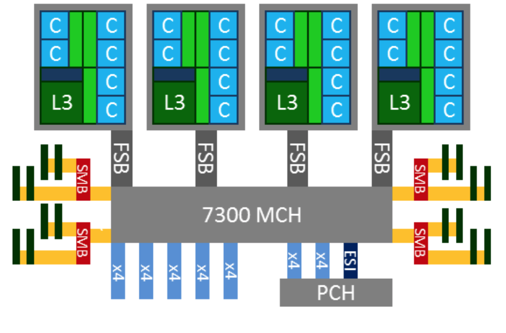
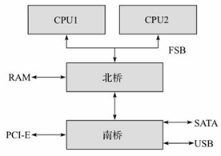
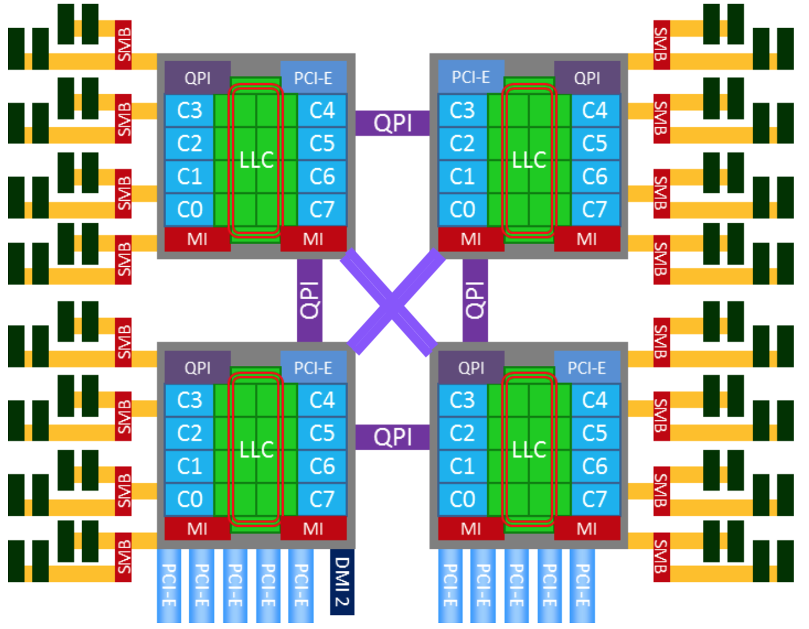
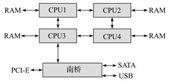
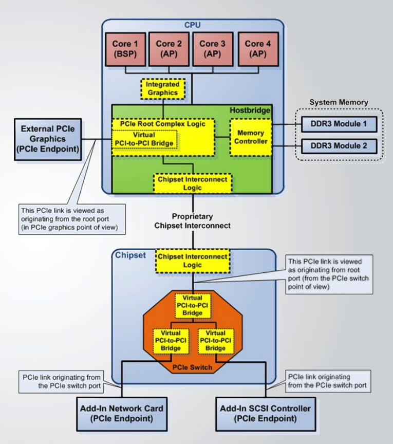

# 【计算机体系结构】NUMA架构详解

> 原文1：<http://oliveryang.net/2016/02/linux-numa-optimization-1/>
> 原文2：<https://houmin.cc/posts/b893097a/>

## 基本概念

### SMP VS. AMP

- SMP(Symmetric Multiprocessing)， 即对称多处理器架构，是目前最常见的多处理器计算机架构。
- AMP(Asymmetric Multiprocessing)， 即非对称多处理器架构，则是与SMP相对的概念。

那么两者之间的主要区别总结下来有这么几点:

- SMP的多个处理器都是同构的，使用相同架构的CPU；而AMP的多个处理器则可能是异构的。
- SMP的多个处理器共享同一内存地址空间；而AMP的每个处理器则拥有自己独立的地址空间。
- SMP的多个处理器操通常共享一个操作系统的实例；而AMP的每个处理器可以有或者没有运行操作系统， 运行操作系统的CPU也是在运行多个独立的实例。
- SMP的多处理器之间可以通过共享内存来协同通信；而AMP则需要提供一种处理器间的通信机制。

现今主流的x86多处理器服务器都是SMP架构的，而很多嵌入式系统则是AMP架构的，当不同的CPU架构适合特定活动（如 DSP 和 MCU）时，有可能使用 AMP。

> 参考：[操作系统之SMP和AMP系统](https://cloud.tencent.com/developer/article/1413542)

### NUMA VS. UMA

NUMA(Non-Uniform Memory Access) 非均匀内存访问架构是指多处理器系统中，内存的访问时间是依赖于处理器和内存之间的相对位置的。 这种设计里存在和处理器相对近的内存，通常被称作本地内存；还有和处理器相对远的内存， 通常被称为非本地内存。

UMA(Uniform Memory Access) 均匀内存访问架构则是与NUMA相反，所以处理器对共享内存的访问距离和时间是相同的。

由此可知，不论是NUMA还是UMA都是SMP架构的一种设计和实现上的选择。

阅读文档时，也常常能看到ccNUMA(Cache Coherent NUMA)，即缓存一致性NUMA架构。 这种架构主要是在NUMA架构之上保证了多处理器之间的缓存一致性。降低了系统程序的编写难度。

x86多处理器发展历史上，早期的多核和多处理器系统都是UMA架构的。这种架构下， 多个CPU通过同一个北桥(North Bridge)芯片与内存链接。北桥芯片里集成了内存控制器(Memory Controller)，

下图是一个典型的早期 x86 UMA 系统，四路处理器通过 FSB (前端系统总线, Front Side Bus) 和主板上的内存控制器芯片 (MCH, Memory Controller Hub) 相连，DRAM 是以 UMA 方式组织的，延迟并无访问差异。

加上IO访问，简化的结构如下

>更早期的结构是内存控制器（MC）被集成在北桥中，这样导致和CPU的数据交互全部都通过北桥控制，在多个CPU访问同一内存时存在阻塞，后面才将MC分离出来缓解这一问题，但是核心的瓶颈还是在北桥上。
>

在UMA 架构下，CPU 和内存控制器之间的前端总线 (FSB)和北桥 在系统 CPU 数量不断增加的前提下，成为了系统性能的瓶颈。因此，AMD在引入64位x86架构时，实现了NUMA架构。之后，Intel也推出了x64的Nehalem架构，x86进入到NUMA 时代。x86 NUMA目前的实现属于 ccNUMA。

从Nehalem架构开始，x86开始转向 NUMA 架构，内存控制器芯片被集成到处理器内部，多个处理器通过QPI链路相连，从此DRAM访问也有了远近之分。 而Sandybridge架构则更近一步，将片外的IOH芯片也集成到了处理器内部，至此，内存控制器和PCIe Root Complex全部在处理器内部了。 下图就是一个典型的 x86 的 NUMA 架构：

简化的结构如下：

## NUMA Hierarchy

### NUMA Node 内部

一个NUMA Node内部是由一个物理CPU和它所有的本地内存(Local Memory)组成的。广义得讲， 一个NUMA Node内部还包含本地IO资源，对大多数Intel x86 NUMA平台来说，主要是PCIe总线资源。 ACPI规范就是这么抽象一个NUMA Node的。

### 物理 CPU

一个CPU Socket里可以由多个CPU Core和一个Uncore部分组成。每个CPU Core内部又可以由两个CPU Thread组成。 每个CPU thread都是一个操作系统可见的逻辑CPU。对大多数操作系统来说，一个八核HT打开的CPU会被识别为16个CPU。 下面就说一说这里面相关的概念，

- Socket
  一个Socket对应一个物理CPU。 这个词大概是从CPU在主板上的物理连接方式上来的，可以理解为 Socket 就是主板上的 CPU 插槽。处理器通过主板的Socket来插到主板上。 尤其是有了多核(Multi-core)系统以后，Multi-socket系统被用来指明系统到底存在多少个物理CPU。

- Node
  NUMA体系结构中多了Node的概念，这个概念其实是用来解决core的分组的问题。每个node有自己的内部CPU，总线和内存，同时还可以访问其他node内的内存，NUMA的最大的优势就是可以方便的增加CPU的数量。通常一个 Socket 有一个 Node，也有可能一个 Socket 有多个 Node。

- Core
  CPU的运算核心。 x86的核包含了CPU运算的基本部件，如逻辑运算单元(ALU), 浮点运算单元(FPU), L1和L2缓存。 一个Socket里可以有多个Core。如今的多核时代，即使是Single Socket的系统， 也是逻辑上的SMP系统。但是，一个物理CPU的系统不存在非本地内存，因此相当于UMA系统。

- Uncore
  Intel x86物理CPU里没有放在Core里的部件都被叫做Uncore。Uncore里集成了过去x86 UMA架构时代北桥芯片的基本功能。 在Nehalem时代，内存控制器被集成到CPU里，叫做iMC(Integrated Memory Controller)。 而PCIe Root Complex还做为独立部件在IO Hub芯片里。到了SandyBridge时代，PCIe Root Complex也被集成到了CPU里。 现今的Uncore部分，除了iMC，PCIe Root Complex，还有QPI(QuickPath Interconnect)控制器， L3缓存，CBox(负责缓存一致性)，及其它外设控制器。

- Threads
  这里特指CPU的多线程技术。在Intel x86架构下，CPU的多线程技术被称作超线程(Hyper-Threading)技术。 Intel的超线程技术在一个处理器Core内部引入了额外的硬件设计模拟了两个逻辑处理器(Logical Processor)， 每个逻辑处理器都有独立的处理器状态，但共享Core内部的计算资源，如ALU，FPU，L1，L2缓存。 这样在最小的硬件投入下提高了CPU在多线程软件工作负载下的性能，提高了硬件使用效率。 x86的超线程技术出现早于NUMA架构。

## 本地内存

在Intel x86平台上，所谓本地内存，就是CPU可以经过Uncore部件里的iMC访问到的内存。而那些非本地的， 远程内存(Remote Memory)，则需要经过QPI的链路到该内存所在的本地CPU的iMC来访问。 曾经在Intel IvyBridge的NUMA平台上做的内存访问性能测试显示，远程内存访问的延时时本地内存的一倍。

可以假设，操作系统应该尽量利用本地内存的低访问延迟特性来优化应用和系统的性能。

## 本地 IO 资源

如前所述，Intel自从SandyBridge处理器开始，已经把PCIe Root Complex集成到CPU里了。 正因为如此，从CPU直接引出PCIe Root Port的PCIe 3.0的链路可以直接与PCIe Switch或者PCIe Endpoint相连。 一个PCIe Endpoint就是一个PCIe外设。这就意味着，对某个PCIe外设来说，如果它直接于哪个CPU相连， 它就属于哪个CPU所在的NUMA Node。

与本地内存一样，所谓本地IO资源，就是CPU可以经过Uncore部件里的PCIe Root Complex直接访问到的IO资源。 如果是非本地IO资源，则需要经过QPI链路到该IO资源所属的CPU，再通过该CPU PCIe Root Complex访问。 如果同一个NUMA Node内的CPU和内存和另外一个NUMA Node的IO资源发生互操作，因为要跨越QPI链路， 会存在额外的访问延迟问题。

其它体系结构里，为降低外设访问延迟，也有将IB(Infiniband)总线集成到CPU里的。 这样IB设备也属于NUMA Node的一部分了。

可以假设，操作系统如果是NUMA Aware的话，应该会尽量针对本地IO资源低延迟的优点进行优化。

## NUMA Affinity

NUMA Affinity(亲和性)是和NUMA Hierarchy(层级结构)直接相关的。对系统软件来说， 以下两个概念至关重要，

- CPU NUMA Affinity
  CPU NUMA的亲和性是指从CPU角度看，哪些内存访问更快，有更低的延迟。如前所述， 和该CPU直接相连的本地内存是更快的。操作系统如果可以根据任务所在CPU去分配本地内存， 就是基于CPU NUMA亲和性的考虑。因此，CPU NUMA亲和性就是要尽量让任务运行在本地的NUMA Node里。

- Device NUMA Affinity
  设备NUMA亲和性是指从PCIe外设的角度看，如果和CPU和内存相关的IO活动都发生在外设所属的NUMA Node， 将会有更低延迟。这里有两种设备NUMA亲和性的问题，

  - DMA Buffer NUMA Affinity
    大部分PCIe设备支持DMA功能的。也就是说，设备可以直接把数据写入到位于内存中的DMA缓冲区。 显然，如果DMA缓冲区在PCIe外设所属的NUMA Node里分配，那么将会有最低的延迟。 否则，外设的DMA操作要跨越QPI链接去读写另外一个NUMA Node里的DMA缓冲区。 因此，操作系统如果可以根据PCIe设备所属的NUMA node分配DMA缓冲区， 将会有最好的DMA操作的性能。

  - Interrupt NUMA Affinity
    设备DMA操作完成后，需要在CPU上触发中断来通知驱动程序的中断处理例程(ISR)来读写DMA缓冲区。 很多时候，ISR触发下半部机制(SoftIRQ)来进入到协议栈相关(Network，Storage)的代码路径来传送数据。 对大部分操作系统来说，硬件中断(HardIRQ)和下半部机制的代码在同一个CPU上发生。 因此，DMA缓冲区的读写操作发生的位置和设备硬件中断(HardIRQ)密切相关。假设操作系统可以把设备的硬件中断绑定到自己所属的NUMA node， 那之后中断处理函数和协议栈代码对DMA缓冲区的读写将会有更低的延迟。

## Firmware 接口

由于NUMA的亲和性对应用的性能非常重要，那么硬件平台就需要给操作系统提供接口机制来感知硬件的NUMA层级结构。 在x86平台，[ACPI规范](./resource/ACPI_6_3.pdf)提供了以下接口来让操作系统来检测系统的NUMA层级结构。

ACPI 5.0a规范的第17章是有关NUMA的章节。ACPI规范里，NUMA Node被第9章定义的Module Device所描述。 ACPI规范里用Proximity Domain对NUMA Node做了抽象，两者的概念大多时候等同。

- SRAT(System resource Affinity Table)
  主要描述了系统boot时的CPU和内存都属于哪个Proximity Domain(NUMA Node)。 这个表格里的信息时静态的，如果是启动后热插拔，需要用OSPM的_PXM方法去获得相关信息。

- SLIT(System Locality Information Table)
  提供CPU和内存之间的位置远近信息。在SRAT表格里，只能告诉给定的CPU和内存是否在一个NUMA Node。 对某个CPU来说，不在本NUMA Node里的内存，即远程内存们是否都是一样的访问延迟取决于NUMA的拓扑有多复杂(QPI的跳数)。 总之，对于不能简单用远近来描述的NUMA系统(QPI存在0，1，2等不同跳数)， 需要SLIT表格给出进一步的说明。同样的，这个表格也是静态表格，热插拔需要使用OSPM的_SLI方法。

- DSDT(Differentiated System Description Table)
  从Device NUMA角度看，这个表格给出了系统boot时的外设都属于哪个Proximity Domain(NUMA Node)。

ACPI规范OSPM(Operating System-directed configuration and Power Management) 和OSPM各种方法就是操作系统里的ACPI驱动和ACPI firmware之间的一个互动的接口。 x86启动OS后，没有ACPI之前，firmware(BIOS)的代码是无法被执行了，除非通过SMI中断处理程序。 但有了ACPI，BIOS提前把ACPI的一些静态表格和AML的bytecode代码装载到内存， 然后ACPI驱动就会加载AML的解释器，这样OS就可以通过ACPI驱动调用预先装载的AML代码。 AML(ACPI Machine Language)是和Java类似的一种虚拟机解释型语言，所以不同操作系统的ACPI驱动， 只要有相同的虚拟机解释器，就可以直接从操作系统调用ACPI写好的AML的代码了。 所以，前文所述的所有热插拔的OSPM方法，其实就是对应ACPI firmware的AML的一段函数代码而已。

## Software 接口

- Windows
  参考:
  1. <https://docs.microsoft.com/en-us/windows/win32/memory/allocating-memory-from-a-numa-node>
  2. <https://docs.microsoft.com/en-us/windows/win32/procthread/numa-support>

- Linux
  参考：
  1. <https://man7.org/linux/man-pages/man3/numa.3.html> libnuma
  2. <https://blog.csdn.net/qq_40379678/article/details/107814666> libnuma 详解

> 🚧详细参考[NUMA感知](./NUMA感知.md)

## 参考

1. <https://rtoax.blog.csdn.net/article/details/108938666>
2. <http://scitechconnect.elsevier.com/asymmetric-multi-processing-amp-vs-symmetric-multi-processing-smp/> AMP vs. SMP
3. <https://cloud.tencent.com/developer/article/1413542> 操作系统之SMP和AMP系统
4. <http://oliveryang.net/2016/02/linux-numa-optimization-1/> Linux NUMA Optimization
