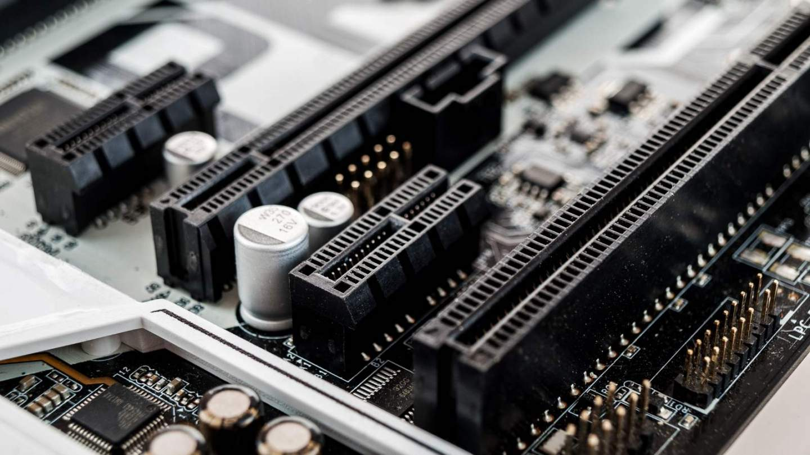

# PCI Express

## 资料

1. <https://zh.wikipedia.org/wiki/PCI_Express> __PCI Express总线介绍__
   > PCIe总线系统简介。
2. <https://zhuanlan.zhihu.com/p/70125574> __PCIe的通道是怎么分分合合的？详解PCIe bifurcation__
   > 介绍PCIe插槽如何分叉。
3. <https://zhuanlan.zhihu.com/p/222449803> __基于Linux系统的PCIe常见问题定位总结__
   > Linux系统下如何查看PCIe设备拓扑，链路状态判断。
4. <https://www.kernel.org/doc/html/latest/PCI/index.html> __Linux PCI Bus Subsystem__
   > Linux PCI 数据驱动。
5. <https://www.cnblogs.com/LoyenWang/p/14165852.html> __Linux PCI驱动框架分析（一）__
   > PCIe总线硬件和数据通信框架。
6. <https://www.cnblogs.com/LoyenWang/p/14209318.html> __Linux PCI驱动框架分析（二）__
   > Linux PCI子系统的框架。
7. <https://www.cnblogs.com/LoyenWang/p/14255906.html> __Linux PCI驱动框架分析（三）__
   > Linux PCI Host驱动。
