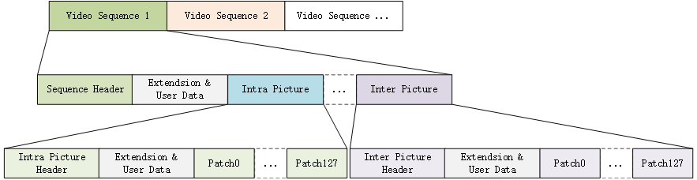

# AVS3 码流顶层结构

## 1. 概要

这里对AVS3视频数据二进制码流顶层结构作简单分析。

## 2. 视频码流



视频码流由一个或多个视频序列组成，一个视频序列中包含了序列头，附加数据，视频帧数据。视频帧数据中包含了帧头，附加数据和帧内分块编码数据。附加数据是可选的。

### 2.1 起始码

起始码长度固定32bit，前24bit固定为起始码前缀，后8bit为数据段类型标识。

```txt
 0 1 2 3 4 5 6 7 0 1 2 3 4 5 6 7 0 1 2 3 4 5 6 7 0 1 2 3 4 5 6 7
+-+-+-+-+-+-+-+-+-+-+-+-+-+-+-+-+-+-+-+-+-+-+-+-+-+-+-+-+-+-+-+-+
|          start code prefix (0x000001)         |      type     |
+-+-+-+-+-+-+-+-+-+-+-+-+-+-+-+-+-+-+-+-+-+-+-+-+-+-+-+-+-+-+-+-+
```

起始码前缀是位串`‘0000 0000 0000 0000 0000 0001’`，数据段类型如下：

|类型|值|
|-|-|
|片起始码（patch_start_code）|0x00～0x7F|
|保留|0x80～0x8E|
|片结束码（patch_end_code）|0x8F|
|保留|0x90～0xAF|
|视频序列起始码（video_sequence_start_code）|0xB0|
|视频序列结束码（video_sequence_end_code）|0xB1|
|用户数据起始码（user_data_start_code）|0xB2|
|帧内预测图像起始码（intra  _picture_start_code）|0xB3|
|保留|0xB4|
|视频扩展起始码（extension_start_code）|0xB5|
|帧间预测图像起始码（inter_picture_start_code）|0xB6|
|视频编辑码（video_edit_code）|0xB7|
|保留|0xB8|
|系统起始码|0xB9～0xFF|

> 参考[信息技术智能媒体编码第2部分：视频](resource/AVS3-P2-TAI109.2-2021.pdf)中的`表13`。

`视频序列结束码`和`视频编辑码`都可用作视频序列数据结束的标识。

片起始码的范围是0~127，所以每帧图像最多包含128个图像片段。

为了避免起始码的前缀在码流的解析中会出现冲突，在编码器中还需要进行伪起始码消除。[信息技术智能媒体编码第2部分：视频](resource/AVS3-P2-TAI109.2-2021.pdf)附录A的原文：

>为了防止出现伪起始码，编码时应按照以下方法处理：写入一位时，如果该位是一个字节的第二最低有效位，检查该位之前写入的22位，如果这22位都是‘0’，在该位之前插入‘10’，该位成为下一个字节的最高有效位。
>解码时应按以下方法处理：每读入一个字节时，检查前面读入的两个字节和当前字节，如果这三个字节构成位串‘0000 0000 0000 0000 0000 0010’，丢弃当前字节的最低两个有效位。丢弃一个字节最低两个有效位可采用任意等效的方式，本文件 不做规定。
>在编码和解码时对于序列头、序列显示扩展、时域可伸缩扩展、版权扩展、内容加密扩展、目标设备显示和内容元数据扩展、参考知识图像扩展、用户数据、摄像机参数扩展、视频扩展数据保留字节中的数据不应采用上述方法。

上面的描述可以理解为，伪起始码的处理在编解码器的块编解码时处理，视频序列头数据和扩展数据的不处理伪起始码（在AVS标准文档`视频序列语义描述`章节有说明这些数据不允许在任意字节对齐的位置出现连续21个以上连续的‘0’比特位）。这种方式相对于AVC/HEVC的Annex-B格式要更节省数据量，只需要2个bit即可处理（Annex-B的EBSP块需要插入一个0x03字节），但是编解码器代码处理上可能相对麻烦一点。

伪起始码消除规则：

- 0b 0000 0000 0000 0000 0000 0000 => 0b 0000 0000 0000 0000 0000 0010 00
- 0b 0000 0000 0000 0000 0000 0001 => 0b 0000 0000 0000 0000 0000 0010 01
- 0b 0000 0000 0000 0000 0000 0010 => 0b 0000 0000 0000 0000 0000 0010 10
- 0b 0000 0000 0000 0000 0000 0011 => 0b 0000 0000 0000 0000 0000 0010 11

### 2.2 视频序列头

序列头数据类似AVC/HEVC的SPS和PPS数据，它主要包含：编码参数，编码档次，基准，逐行/隔行，图像高宽，帧率，比特率等信息。同一个视频序列中的图像共享同一个序列头数据。

### 2.3 附加数据

附加数据分为扩展数据（extension_data）和用户数据（user_data），扩展数据主要存放版权，内容加密，摄像机参数，HDR等信息，用户数据主要存放扩展的自定义数据信息。

扩展数据中的不同类型信息的开头都包含了4个bit的类型标识，具体类型参考[信息技术智能媒体编码第2部分：视频](resource/AVS3-P2-TAI109.2-2021.pdf)中的`表18`。

用户数据内容固定长度8bit整数，数据的含义由用户自行定义，为了避免伪起始码问题，如果使用最好不要定义0x00。

### 2.4 图像数据

图像数据包含了按解码顺序存放的帧序列数据，每一帧数据中包含固定的帧内预测图像头或是帧间预测图像头，以及一个或多个图像片段编码数据（最多128个）。

帧数据中也可以包含扩展数据和用户数据，但是扩展数据和紧跟在序列头后定义的扩展数据所能存放的信息有差异，具体参考[信息技术智能媒体编码第2部分：视频](resource/AVS3-P2-TAI109.2-2021.pdf)中的`表18`。

## 3. 资料

1. <https://blog.csdn.net/leelitian3/article/details/112445617> AVS3码流结构解析
    > avs3 视频数据序列结构图。
