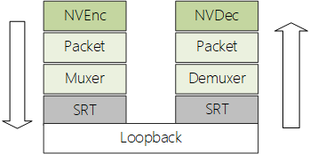

# libsrt live模式下的传输延迟分析

[TOC]

## 测试

通过在单机环境下使用libsrt库传输HEVC实时码流测试延迟，同时使用NVCodec减少CPU消耗对传输的影响。

### 1.测试方案

__测试环境：__

  1. 单机测试环境: Windows11系统，Nvdia RTX A4000显卡，Intel(R) Core(TM) i7-7820X CPU @ 3.60GHz。
  2. NVCodec版本11.0，FFmpeg4.2，libsrt1.4.2。
  3. 片源4K YUV422 8bit 50P，编码格式选择HEVC IPP，VBR码率9-12Mbps。
  4. libsrt使用live模式，单包传输1316Bytes，带宽设置到100Mbps。

__测试系统：__

编解码器使用NVCodec硬件编解码，Muxer/Demuxer使用ffmpeg封装mpegts格式数据，为了减小网络传输延迟影响使用本地回环网络进行测试。

__延迟测定方法：__

  1. 单机环境，测试系统时钟直接取系统时间。
  2. 第n帧送编码器前记录时间戳ETn，压栈。
  3. 编码完成送封包器前时间戳ETn出栈，取系统时间戳STn，计算编码延迟STn-ETn，同时STn转换到PTS记录到Packet。
  4. 接收方包重组数据解包后取PTS转换到时间戳STn，取系统时间戳RTn，计算传输延迟RTn-STn，同时RTn转换到PTS记录到Packet。
  5. 解码后取系统时间戳DTn，计算解码延迟DTn-RTn。

同时测试过程中调整SRT延迟参数，观察这些参数传输延迟的影响。

帧率目前控制在50P，延迟通常都在百毫秒级，系统参考时钟精度取到毫秒即可。MEPG-TS的PES包中DTS和PTS的有效长度是30比特，但是系统时间即使只取到毫秒精度也会超过32比特，这里只保留24比特有效位即可（有效范围在0-16777215毫秒，测试延迟完全够用），时间戳的推导：system_time_ms & 0x00FFFFFF。

### 2.测试结果

根据测试系统推导主要的延迟组成部分：编码耗时+MPEG-TS封装耗时+SRT传输耗时+MPEG-TS解封装耗时+解码耗时。SRT传输耗时包含发送耗时，接收耗时和网络协议栈耗时，其中协议栈使用本地回环耗时都在1毫秒内，这部分延迟忽略不计。

|测试参数|平均编码延迟|平均传输延迟|平均解码延迟|总延迟|
|-|-|-|-|-|
|SRTO_LATENCY=0ms|16ms|45ms|47ms|108ms|
|SRTO_LATENCY=1ms|16ms|47ms|47ms|110ms|
|SRTO_LATENCY=5ms|16ms|49ms|47ms|112ms|
|SRTO_LATENCY=10ms|16ms|53ms|47ms|116ms|
|SRTO_LATENCY=20ms|16ms|61ms|47ms|124ms|
|SRTO_LATENCY=30ms|16ms|71ms|47ms|134ms|
|SRTO_LATENCY=40ms|16ms|81ms|47ms|144ms|
|SRTO_LATENCY=50ms|16ms|91ms|47ms|154ms|
|SRTO_LATENCY=100ms|16ms|141ms|47ms|204ms|
|SRTO_LATENCY=200ms|16ms|241ms|47ms|304ms|

> 平均传输延迟包含了MPEG-TS封装/解封装耗时，MPEG-TS封装耗时测试都小于1毫秒，解封装延迟固定2帧画面的数据按照帧率计算这里相当于40毫秒。

## 发送方延迟分析

### 1.编码器延迟

编码器采用NVEnc同步编码方式，整个编码过程主要分为：源数据上行到显存，编码，码流拷贝输出。

4K 422 8bit数据内存大小为16,588,800Bytes，上行到显存平均耗时需要4毫秒，这一块可以通过直接使用显存进行优化。

单帧码流通常200KB大小，输出耗时1毫秒内。

### 2.libsrt发送延迟

从发送方看延迟主要分为：受带宽控制的包调度延迟，网络链路延迟，接收方确认延迟（确认后才能继续发送后续数据）。

包调度延迟由发送方所决定（虽然连接建立时有协商，实际传输时还是由发送方控制），产生的原因是流量平滑导致的发送周期调整，这一部分和实际内容码率已经协商后的带宽参数相关。通常协商带宽越大，传输层收到数据后就可以用最小的调度周期进行发送。__通常视频序列中I帧要码流占比非常大，配置发送带宽参数时以码率为基准进行配置会导致I帧的发送延迟相对较大，如果需要获得最低的延迟的效果则必须考虑I帧的大小导致的传输延迟。__

网络链路延迟是物理链路所决定，不管是由于确认超时引起的重传还是，接收方发起的重传，均是和物理链路相关，属于外部不可控因素暂不讨论。

接收方确认延迟主要是由于NACKs机制和网络链路延迟导致，NACKs机制会等待64个包或者10毫秒后才会触发一次确认响应，如果不计链路延迟的清空下可以得到确认延迟最大为10毫秒。

### 3.封装延迟

封装延迟在单视频流情况下平均耗时小于1毫秒，组TS包后直接进传输层，但是在存在音视频流的情况下，ffmepg会进行缓存控制保证音画数据交错同步输出，这里会带来一定延迟，主要取决于音视频数据交付时间差。

## 接收方延迟分析

### 1.解码器延迟

解码器使用NVDec异步解码，解码过程主要分为：码流解析，码流解码，帧画面输出。

经过代码调试码流解析通常有1帧的延迟，按照50FPS计算大概是20毫秒，不知道其内部机制，在NVCodec的文档中看可以替换到ffmpeg的码流解析过程。

帧画面输出主要是显存拷贝到内存，通过是3毫秒，通过直接显存访问也可以进行优化。

### 2.libsrt接收延迟

接收延迟主要分为：网络链路延迟，交付上层延迟。

网络链路延迟是物理链路所决定。

从测试结果看传输整体延迟和设置的`SRTO_LATENCY`参数正相关，但是从[SRT选项描述](./libsrt/srt_options(zh).md)文档中得知，这个参数实际上控制的是接收方的接收延迟和本端接收延迟，传输过程中发送方不会收到媒体数据，那么这个选项只能控制接收方的接收延迟。

通过对libsrt代码分析发现，即使接收方已经收到数据包并确认后还是需要等待数据包的接收延迟超过`SRTO_LATENCY`后才能被应用获取，这样也就解释了为什么传输整体延迟和设置的`SRTO_LATENCY`参数正相关。目前最新的`1.4.4`版本代码任然如此，这样导致在实际应用中我们设置的延迟参数越接近实际的 __传输延迟波动__ 才能获得最低延迟效果，但是这个基本没法做到，这里代码可能得优化到零延迟交付应用才能获取到最好的效果。

### 3.解封装延迟

解封装延迟主要是在ffmpeg内部从TS包恢复PES数据时带来的延迟，单包恢复过程在微秒级别，但需要收到一个完整PES后（多个网络数据包）才能交付出来，这里通过调试代码发现固定有2帧延迟（还未分析代码过程）。

## 参考

1. [libsrt缓冲区](libsrt_buffer.md)
