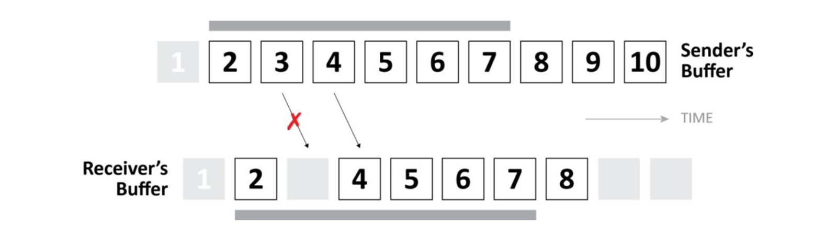

# libsrt NAKS机制

## 概要

SRT为了应对网络丢包加入了重传机制，negative acknowledgment(NAK)报告是重传机制的一个重要实现方式。

SRT数据报文具有连续的报文序号，这样可以在接收端通过收到的报文的序号是否连续对丢包进行判断，如果packet 4到达了接受者的buffer，但是packet 3并没有到达，则发生丢包，NAK报文就需要发送给发送方。



同时NAK会被加到一个列表(周期的NAK报告)，其周期的发送给发送方，以此避免NAK报文本身传输中丢失或延迟到达。

SRT的周期性NAK Reports是基于RTT/2为周期，最小20ms。一个NAK控制报文含有一个丢失报文的压缩列表，所以，仅仅丢失的报文会被重传。通过使用RTT/2作为NAK报告的周期，这会导致丢失报文可能会被重传一次以上，但是这样会保持低延时在NAK报文丢失的情况下。

在libsrt1.4.4版本中发送方对一个RTT周期内的NAK报告响应做了优化，在一个RTT周期内同一个数据包只会触发一次重传，这样可以减少重传导致的带宽压力。

下面根据libsrt1.4.4的关键代码对NAK机制的触发场景进行具体分析。

## 代码分析

__1. libsrt 数据接收过程中丢包识别的关键代码：__

```cpp
int srt::CUDT::processData(CUnit* in_unit)
{
    bool need_notify_loss = true;
    {
        UniqueLock recvbuf_acklock(m_RcvBufferLock);
        for (vector<CUnit *>::iterator i = incoming.begin(); i != incoming.end(); ++i)
        {
            CUnit *  u    = *i;
            CPacket &rpkt = u->m_Packet;
            if (adding_successful)
            {
                if (need_notify_loss && CSeqNo::seqcmp(rpkt.m_iSeqNo, CSeqNo::incseq(m_iRcvCurrSeqNo)) > 0) // Loss detection.
                {
                    int32_t seqlo = CSeqNo::incseq(m_iRcvCurrSeqNo);
                    int32_t seqhi = CSeqNo::decseq(rpkt.m_iSeqNo);
                    srt_loss_seqs.push_back(make_pair(seqlo, seqhi));
                }
            }

            if (CSeqNo::seqcmp(rpkt.m_iSeqNo, m_iRcvCurrSeqNo) > 0)
            {
                m_iRcvCurrSeqNo = rpkt.m_iSeqNo; // Latest possible received
            }
            else
            {
                unlose(rpkt); // was BELATED or RETRANSMITTED
                was_sent_in_order &= 0 != pktrexmitflag;
            }
        }
    } // End of recvbuf_acklock
```

从代码中可以看到，是通过对当前包的序号和当前已接收的数据包序号加1进行比对得到是否发生了丢包。识别到丢包后将丢失的包序号范围添加到`srt_loss_seqs`中。

> `m_iRcvCurrSeqNo`的初始值在握手包中会携带。

当序号相等或者小于的情况下还会触发`unclose`逻辑，这个里面会查找丢包管理队列移除相应的数据包序号。

__2. 触发丢包重传的关键代码：__

```cpp
int srt::CUDT::processData(CUnit* in_unit)
{
    if (!srt_loss_seqs.empty())
    {
        // A loss is detected
        {
            ScopedLock lg(m_RcvLossLock);
            for (loss_seqs_t::iterator i = srt_loss_seqs.begin(); i != srt_loss_seqs.end(); ++i)
            {
                // If loss found, insert them to the receiver loss list
                m_pRcvLossList->insert(i->first, i->second);
            }
        }

        const bool report_recorded_loss = !m_PacketFilter || m_PktFilterRexmitLevel == SRT_ARQ_ALWAYS;
        if (!reorder_prevent_lossreport && report_recorded_loss)
        {
            sendLossReport(srt_loss_seqs);
        }

        if (m_bTsbPd)
        {
            HLOGC(qrlog.Debug, log << "loss: signaling TSBPD cond");
            CSync::lock_signal(m_RcvTsbPdCond, m_RecvLock);
        }
        else
        {
            HLOGC(qrlog.Debug, log << "loss: socket is not TSBPD, not signaling");
        }
    }
    ...
}
```

`srt_loss_seqs`会被添加到`m_pRcvLossList`中记录当前的识别到的掉包信息，再通过`reorder_prevent_lossreport`和`report_recorded_loss`来判断是否立即发送NAK报告。`report_recorded_loss`通常都是true，`m_PacketFilter`通常不会设置；`reorder_prevent_lossreport`主要是为了兼容包乱序的情况，延迟发送NAK，但是这个值依靠`m_iReorderTolerance`（对应于[SRTO_LOSSMAXTTL](./libsrt/srt_options(zh).md####SRTO_LOSSMAXTTL)配置），默认情况下这个值设置是flase，这样会导致对于包乱序的情况下会直接识别为丢包，立即发送NAK，从而让发送端带来不必要的重传。

在广域网的应用中SRTO_LOSSMAXTTL选项设置后可以带来更好的网络性能。

__3. 丢包/乱序识别重传：__

```cpp
int srt::CUDT::processData(CUnit* in_unit)
{
    ...
    vector<int32_t> lossdata;
    {
        ScopedLock lg(m_RcvLossLock);

        // XXX There was a mysterious crash around m_FreshLoss. When the initial_loss_ttl is 0
        // (that is, "belated loss report" feature is off), don't even touch m_FreshLoss.
        if (initial_loss_ttl && !m_FreshLoss.empty())
        {
            deque<CRcvFreshLoss>::iterator i = m_FreshLoss.begin();

            // Phase 1: take while TTL <= 0.
            // There can be more than one record with the same TTL, if it has happened before
            // that there was an 'unlost' (@c dropFromLossLists) sequence that has split one detected loss
            // into two records.
            for (; i != m_FreshLoss.end() && i->ttl <= 0; ++i)
            {
                addLossRecord(lossdata, i->seq[0], i->seq[1]);
            }

            // Remove elements that have been processed and prepared for lossreport.
            if (i != m_FreshLoss.begin())
            {
                m_FreshLoss.erase(m_FreshLoss.begin(), i);
                i = m_FreshLoss.begin();
            }

            if (m_FreshLoss.empty())
            {
                HLOGP(qrlog.Debug, "NO MORE FRESH LOSS RECORDS.");
            }
            else
            {
                HLOGF(qrlog.Debug,
                      "STILL %" PRIzu " FRESH LOSS RECORDS, FIRST: %d-%d (%d) TTL: %d",
                      m_FreshLoss.size(),
                      i->seq[0],
                      i->seq[1],
                      1 + CSeqNo::seqoff(i->seq[0], i->seq[1]),
                      i->ttl);
            }

            // Phase 2: rest of the records should have TTL decreased.
            for (; i != m_FreshLoss.end(); ++i)
                --i->ttl;
        }
    }
    if (!lossdata.empty())
    {
        sendCtrl(UMSG_LOSSREPORT, NULL, &lossdata[0], (int) lossdata.size());
    }
    ...
}
```

`SRTO_LOSSMAXTTL`设置后会导致遇到真的丢包时无法立即重传，从而导致延迟增加，但是丢包和乱序无法直接识别，这里通过将识别到的可能丢包的序号先添加到`m_FreshLoss`中，每个记录会有一个TTL值，当TTL值减小到0时就立即发送NAK报告。这样就可以在延迟和丢包识别中取得一些平衡，带来更好的性能。

为了更好的适应网络状况，对乱序的识别条件也会动态调整：

```cpp
int srt::CUDT::processData(CUnit* in_unit)
{
    ...
    if (m_bPeerRexmitFlag && was_sent_in_order)
    {
        ++m_iConsecOrderedDelivery;
        if (m_iConsecOrderedDelivery >= 50)
        {
            m_iConsecOrderedDelivery = 0;
            if (m_iReorderTolerance > 0)
            {
                m_iReorderTolerance--;
                enterCS(m_StatsLock);
                m_stats.traceReorderDistance--;
                leaveCS(m_StatsLock);
                HLOGF(qrlog.Debug,
                      "ORDERED DELIVERY of 50 packets in a row - decreasing tolerance to %d",
                      m_iReorderTolerance);
            }
        }
    }
    return 0;
}
```

`SRTO_LOSSMAXTTL`配置会被映射到`m_iReorderTolerance`，每当遇到50个连续的包时，它会减1，这样对网络状态作一些适应。

同时当一个乱序的包到达时，也会调整`m_iReorderTolerance`：

```cpp
void srt::CUDT::unlose(const CPacket &packet)
{
    ...
        was_reordered = !packet.getRexmitFlag();
        if (was_reordered)
        {
            const int seqdiff = abs(CSeqNo::seqcmp(m_iRcvCurrSeqNo, packet.m_iSeqNo));
            if (seqdiff > m_iReorderTolerance)
            {
                const int new_tolerance = min(seqdiff, m_config.iMaxReorderTolerance);
                m_iReorderTolerance = new_tolerance;
            }
        }
    ...
}
```

## 总结

libsrt的NAK机制实现可以比较快速的响应丢包，发起重传，在一定程度上降低整体的传输延迟，还可以通过一些参数上的调优在延迟和带宽管理上取得更好的效果。对NAK机制产生影响主要参数是RTT和`SRTO_LOSSMAXTTL`配置，RTT完全依赖于对网络传输延迟的测量，所以主要可以通过`SRTO_LOSSMAXTTL`配置进行干预。

`SRTO_LOSSMAXTTL`越大，它带来的副作用就是在出现丢包时发起重传的延迟就越大，所以它的配置应当根据网络情况来进行调整。在局域网环境下，通常网络状况都是很稳定的，很少出现包乱序的情况，这时不需要配置`SRTO_LOSSMAXTTL`。在互联网环境下，通常伴随带宽受限，包乱序的情况，通过多次的网络测试抓包分析，通常包乱序只会出现在1到2个包间，所以`SRTO_LOSSMAXTTL`的值可以配置到3，如果明确了网络带宽充足（少量重传不会引起进一步的网络拥塞），那这个值也可以不用设置。
