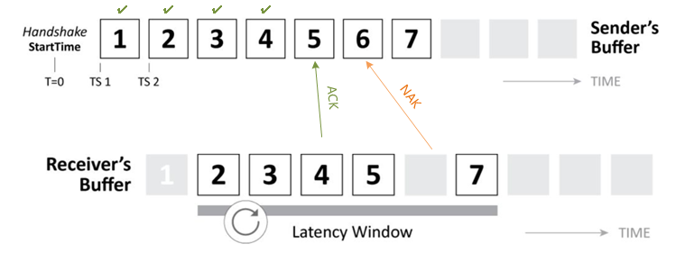
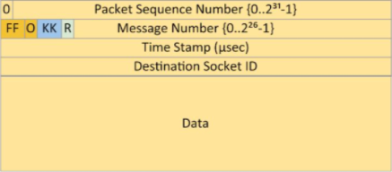
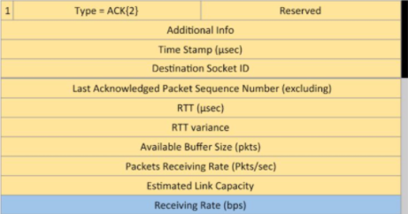
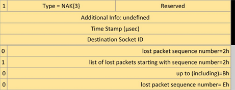
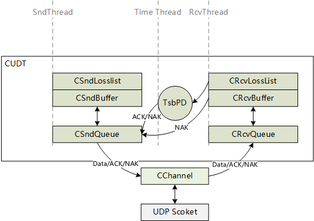
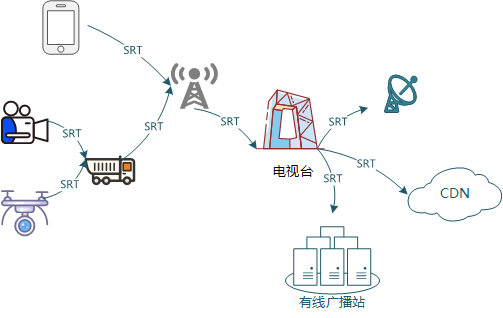

# SRT传输

## 概要

SRT是Secure、Reliable、Transport三个单词的缩写，它是基于UDT传输协议改进而来，是用户层协议，其保留UDT的核心思想和机制，但是做了多项改进，包括对控制报文的修改，针对直播流改进了流控，改进了拥塞算法，报文加密算法。

### 对比

实时媒体流传输场景下特性对比：

| 对比项 | RTMP | SRT | RTP | NDI |
|---|---|---|---|---|
| 支持媒体容器格式 | flv | live模式可以使用mpeg-ts或者RTP，file模式可使用flv，mp4 | RTP或者mpeg-ts | 改进的RTSP+RTP |
| 底层协议 | TCP | UDP | UDP | TCP/Reliable-UDP |
| 连接 | 单播 | 单播（支持冗余链路） | 单播/多播 | 套接字, 单播/组播和前向纠错编码 |
| 传输延迟 | 高 | 中 | 低 | 中 |
| 弱网适应性 | 一般 | 较好 | 差 | 一般 |
| 带宽利用率 | 中 | 高 | 低 | 中 |

RTMP优点：1.传输可靠，视频无花屏问题；2.历史悠久，支持广泛：主流的CDN平台和各种OTT平台基本都支持RTMP。
RTMP缺点：1.弱网适应差，延迟高，存在延迟累积问题；2.基于TCP，对于移动直播场景下的链路切换无法较好的支持。

SRT优点：1. 传输可靠，能较好的适应丢包，抖动等复杂网络环境，带宽利用率高；2.延迟较低，live模式下延迟不会累积；3.安全性好，协议层支持AES加密；4.用户层链路，能适应移动直播场景。
SRT缺点：1. CDN以及各种流媒体服务平台支持不多，终端浏览器等支持少；2.很多网关/防火墙对UDP不友好，导致SRT传输受限。

RTP优点：1.低延迟；2.能适应移动直播场景；3.可以在局域网内多播。
RTP缺点：1.需要单独的信令通道才能传输；2.弱网环境下视频效果差，丢包。

NDI优点：1.延迟较低，FULL模式应用在局域网内可以达到3帧延迟；2.局域网内发现服务，配置方便；3.可以在局域网内多播。
NDI缺点：1.FULL模式只能用于局域网环境，HX需要授权；2.闭源，没有OTT服务支持。

## 框架&原理

### 协议框架

SRT的核心组成部分：

- 发送缓冲区：序列化数据，保障重传机制运行（ACK+NAK）。
- 接收缓冲区：构建延迟窗口，重排数据并保障可靠有序的交付数据，对网络情况进行估计分析。

SRT设计的核心就是抗丢包和包序处理，通常的抗丢包方案有两种：FEC（冗余前向纠错）和ARQ（请求重传机制）。SRT两种机制都支持，但是通常FEC只能适用于流量和丢包较低的场景，FEC的冗余数据在复杂的互联网环境下带来的效益较低，FEC模式在SRT中默认都是关闭的。

SRT的ARQ机制是它能够领先于TCP，带来更低延迟和更高的带宽利用率的重要因素。它主要在接收端通过NAK快速报告丢包，请求重传，在发送端通过对ACK包反馈的RTT（平均往返时延）来估计丢包，快速主动发起重传。同时接收端加入延迟窗口，来保证数据交付的延迟，适应实时媒体流传输。

### 报文

SRT中最核心的数据包：数据报文，ACK报文，NAK报文。他们支撑了SRT的各项传输机制。

数据包：

- Packet Sequence Number 包序号，用于数据恢复，丢包识别和请求重传。
- Message Number 消息序号，表示应用层交付的一个连续的数据块，协议层通常会将一个数据块按照MTU拆分成包。
- FF 数据包在一个消息中的位置，10表示起始包，00表示中间包，01表示结束包，11表示单个数据，和Message Number配合使用。
- Time Stamp，包发送时间戳，通常用于接收端进行延迟判断。

ACK包：

- Last Acknowledged Packet Sequence Number，等待接收的下一个包序号。

ACK包主要用于通知发送端数据传输情况和统计到的网络参数，给发送端提供算法参数的参考。

NAK包：

NAK包主要记录丢包信息，既能负载单个包序号，也能负载一组包序号。这样可以快速的请求多个数据重传。

### libsrt

libsrt是Haivision开源的C++ SRT协议传输库，由SRT社区维护。下图是它的核心代码框架：

- CChannel，处理UDP层数据，每个UDP Socket对应一个Channel，多个传输会话可以使用同一个CChannel。
- TsbPD(Timestamp-based Packet Delivery)，负责延时窗口管理，周期性ACK和NAK触发，对抗ACK/NAK丢包。

一个SRT传输会话会有三个线程，分别处理发送，接收，时延窗口管理。

## 媒体流传输应用

目前SRT直播推流场景已经在腾讯云，B站，阿里云等各大互联网厂商落地应用，根据查询到的资料SRT各个方面的表现均有优于RTMP，同时他们对SRT也进行了相应的调整优化。在广播电视领域各个流程也有很多的应用，甚至Haivison也把它应用到了军用无人机场景以及SpaceX的发射过程回传。

### 场景

1. 云上实时制播。
2. 云上切换台。
3. 4G/5G 移动网络环境下直播。
4. 远程协同/面向客户的产品远程教学。
5. 结合硬件收录/转码盒子产品做SRT传输。

需求特性：

 1. 延迟敏感：实时互动，赛事直播，要求延迟低；
 2. 复杂网络环境适配：公网运行，带宽，延迟，丢包等网络参数随时都在变换当中；
 3. 链路随时切换：移动网络直播，伴随位置的移动链路也会发生变化；
 4. 质量要求高：广播电视对媒体质量要求高，码率相对较大，带宽管理要求高。
 5. 安全：公网运行，数据加密。

SRT相对于RTMP能更好的适配复杂网络环境，采用UDP无缝支持链路切换，能在应用层对网络探测的状况做出反应（RTMP采用TCP，内核协议栈管理，无法较好的同步网络状态）。相对于NDI，它开源，社区成员多且活跃，全球各个行业领先的企业都在采用SRT传输方案。相对于RTP/RTCP具有更好的ARQ和带宽管理机制，带来低延迟的同时保证较高传输质量。

### 改进/研究方向

目前的不足：相对于QUIC不支持多通道（多通道可以将音视频放到两个通道传输，分别建立延迟窗口）；拥塞控制算法和带宽管理上比较简单粗暴，相对于QUIC有更多的无效重传带宽占用（测试中发现特别是包乱序导致的重传较多）；容器格式带来的延迟；目前应用配置比较复杂（通常需要配置带宽，延迟，lossmaxtll等参数来适应不同的环境），对现场技术人员有挑战。

协议和算法层面：

1. Live模式下延迟和稳定性平衡性改进：
    目前Live模式下为了适应丢包只能是通过增大延迟窗口解决，但是增大延迟窗口会导致接收端数据交付延迟的增加，可以对接收缓冲区进行优化，例如：收到的连续的数据可以直接交付，不用等到延迟时间窗口过期后才交付。
2. 发送带宽管理改进：
   libsrt对丢包目前采用激进的重传策略（不断的快速重传），导致带宽增加从而进一步引起网络拥塞，相比QUIC协议在相同丢包率情况下SRT的重传率是QUIC的两倍，这里可以参考QUIC协议的算法进行改进。
3. 多模式并行/选择性丢包：
   比如，音频丢包直接不重传，使用OPUS等Codec在码流层通过FEC抗丢包，或者结合SVC编解码方案选择性丢包。

应用层面：

1. 改进Live模式下demuxer容器格式导致的延迟：
   Live模式通常使用MPEG-TS格式包装媒体流，MPEG-TS的PES包无法准确表达包长度特性导致demux存在延迟，可以对它进行改进，通过PES包后立即插入一个空包优化。MPEG-TS还有个缺点是由于TS包头带来了2%的带宽浪费，这点带宽在互联网环境下完全可以利用在重传弱网适配上带来更好的带宽利用率，可以对容器格式进行调整改进。
2. 编码器响应网络：
   通过SRT重传统计，在识别到网络质量较差的情况下，编码器降低码率或者帧率，或者关闭增强层。
3. 本地发现服务：
   SRT在实际应用中相比NDI这些方案，它的配置要更复杂，目前用户侧使用不太友好，结合mDNS和NMOS方案做发现服务能够方便用户在局域网内快速组网使用。
4. 浏览器支持：
   通过SRT数据 Over WebRTC DataChannel，在浏览器上实现通用的SRT流支持，实现低延迟直播和互通直播。目前SRT的官方也在讨论探索中。

## 参考资料

1. <https://cloud.tencent.com/developer/article/1599025> SRT在B站的落地
2. <https://cloud.tencent.com/developer/article/1560855> 全链路适配SRT，腾讯云直播平台再升级
3. <https://www.srtclub.cn/srt-basis.html> 千视整理的SRT知识
4. <https://segmentfault.com/a/1190000023621490> SRT协议在电视直播中的应用
5. <https://zhuanlan.zhihu.com/p/101702312> 详解 TCP 超时与重传机制
6. <https://cloud.tencent.com/developer/article/1372291> SRT特性简介，和QUIC比较
7. <https://www.haivision.com/about/press-releases/haivision-video-streaming-technology-and-srt-protocol-used-for-nasa-spacex-launch/> SRT用于NASA/SpaceX发射
8. <https://github.com/Haivision/srt> libsrt源码
